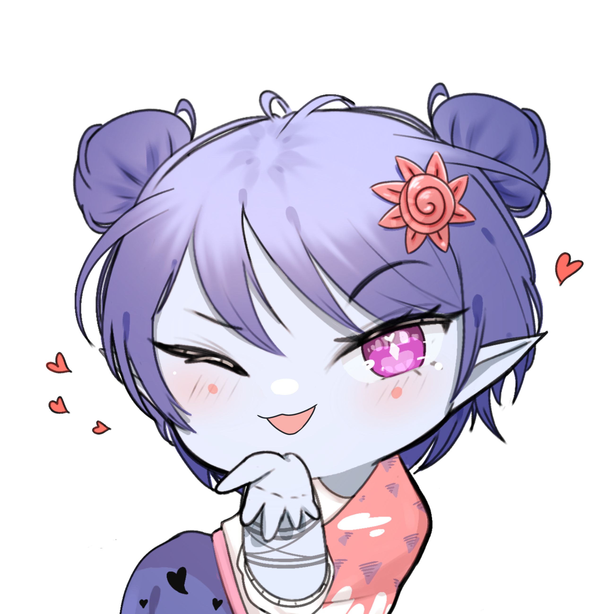

# 🌸 Hachuw Commission Website

Website portfolio + commission untuk freelance digital artist **Hachuw**.

<p align="center">
  
</p>

<p align="center">
  <strong>Hachuw</strong> — Freelance Illustrator
</p>

---

## 📖 Daftar Isi

- [Tentang](#-tentang)
- [Tech Stack](#️-tech-stack)
- [Struktur Project](#-struktur-project)
- [Cara Menjalankan](#-cara-menjalankan-local)
- [Environment Variables](#-environment-variables)
- [Fitur](#-fitur)
- [API Endpoints](#-api-endpoints)
- [Maintenance Commands](#-maintenance-commands)
- [Build Production](#-build-production)
- [Deployment](#-deployment)
- [Security](#-security)
- [License](#-license)
- [Author](#-author)

---

## 🌸 Tentang

Hachuw Commission Website adalah platform yang menampilkan:

- 🎨 **Portfolio** — Karya digital art Hachuw
- 📋 **Commission Info** — Rules, TOS, harga, kategori
- ⏳ **Queue** — Antrian commission yang sedang dikerjakan
- 🛠️ **Admin Panel** — Kelola catalog, kategori, queue, artwork

**Live Demo (Local):** [http://localhost:3000](http://localhost:3000)

**Tech Overview:**
- Frontend & Backend terpisah (2 server)
- Auth menggunakan **BFF Pattern** (Backend-for-Frontend) — token disimpan di HTTP-only cookie
- Image storage dengan abstraction (siap migrasi ke S3/Cloudinary)

---

## 🛠️ Tech Stack

| Kategori | Teknologi | Versi |
|----------|-----------|-------|
| **Backend** | Laravel | 13.31 |
| | PHP | 8.4 |
| | Laravel Sanctum | Latest |
| **Frontend** | Next.js | 16.3 |
| | React | 19 |
| | TypeScript | 5 |
| | Tailwind CSS | v4 |
| **Database** | MySQL | 8.0 |
| **Storage** | Local Disk | (abstraction siap ke S3) |
| **Auth** | Sanctum + BFF | HTTP-only cookie |

**Dev Tools:**
- Laragon (Windows) — PHP + MySQL + Nginx
- Composer 2.x — PHP dependency manager
- npm — Node.js package manager
- VS Code — Editor
- phpMyAdmin — Database manager

---

## 📁 Struktur Project

```
hachuw-comission/
│
├── backend/                          # Laravel 13 API
│   ├── app/
│   │   ├── Http/
│   │   │   ├── Controllers/Api/      # API Controllers
│   │   │   ├── Middleware/
│   │   │   ├── Requests/             # Form Request validation
│   │   │   └── Resources/            # API Resource transformer
│   │   ├── Models/                   # Eloquent Models
│   │   ├── Services/                 # Business logic
│   │   │   └── ImageStorage/         # Image storage abstraction
│   │   └── Providers/
│   ├── bootstrap/app.php             # Middleware & rate limiter
│   ├── config/
│   │   ├── cors.php
│   │   ├── sanctum.php
│   │   └── filesystems.php
│   ├── database/
│   │   ├── migrations/               # 8 migration files
│   │   └── seeders/                  # 5 seeder files
│   ├── public/
│   │   ├── index.php
│   │   └── storage/                  # Symlink ke storage/app/public
│   ├── routes/api.php                # 25+ API routes
│   ├── storage/app/public/           # File uploads
│   │   ├── artworks/                 # 8 slot marquee
│   │   ├── catalog-covers/           # Cover catalog
│   │   └── portfolio-images/         # Portfolio catalog
│   └── .env.example
│
├── frontend/                         # Next.js 16 App
│   ├── app/
│   │   ├── layout.tsx                # Root layout + Navbar + Footer
│   │   ├── page.tsx                  # Landing page
│   │   ├── globals.css               # Tailwind v4 + custom theme
│   │   ├── icon.png                  # Favicon
│   │   ├── opengraph-image.tsx       # Dynamic OG image
│   │   ├── sitemap.ts                # Auto-generate sitemap
│   │   ├── robots.ts                 # Robots config
│   │   │
│   │   ├── catalog/                  # Public: Catalog page
│   │   ├── queue/                    # Public: Queue page
│   │   ├── rules/                    # Public: Rules page
│   │   ├── terms/                    # Public: Terms page
│   │   │
│   │   ├── admin/                    # Admin Panel
│   │   │   ├── layout.tsx            # Sidebar + guard
│   │   │   ├── login/                # Login page
│   │   │   ├── page.tsx              # Dashboard
│   │   │   ├── catalog/              # Catalog CRUD
│   │   │   │   └── [id]/             # Portfolio image manager
│   │   │   ├── kategori/             # Kategori CRUD
│   │   │   ├── queue/                # Queue CRUD + reorder
│   │   │   └── artwork/              # Artwork marquee manager
│   │   │
│   │   └── api/                      # BFF Route Handlers
│   │       ├── auth/                 # Login, logout, me
│   │       └── admin/                # Proxy ke Laravel admin
│   │
│   ├── components/
│   │   ├── ui/                       # Button, Card, Badge, Modal, Toast
│   │   ├── layout/                   # Navbar, Footer, MobileNav
│   │   ├── public/                   # Hero, About, Marquee, Social
│   │   ├── catalog/                  # CatalogCard, CategoryTabs, Modal
│   │   ├── queue/                    # QueueCard, SkeletonQueueList
│   │   └── admin/                    # DataTable, Forms, ImageManager
│   │
│   ├── services/                     # API service layer
│   │   ├── api.ts                    # Public fetch (direct Laravel)
│   │   ├── bff.service.ts            # BFF fetch wrapper
│   │   ├── auth.client.service.ts
│   │   ├── admin.service.ts
│   │   ├── catalog.service.ts
│   │   ├── kategori.service.ts
│   │   ├── queue.service.ts
│   │   └── artwork.service.ts
│   │
│   ├── lib/
│   │   ├── constants/
│   │   │   ├── social-links.ts       # Social media URLs
│   │   │   ├── rules.ts              # Rules (hardcode)
│   │   │   ├── tos.ts                # Terms of Service
│   │   │   └── site.ts               # Site config
│   │   ├── server/auth.ts            # Cookie helper (server-side)
│   │   ├── queue-status.ts           # Status labels & styles
│   │   └── utils.ts                  # cn(), formatRupiah(), etc.
│   │
│   ├── types/                        # TypeScript types
│   ├── public/                       # Static assets
│   │   ├── artworks/                 # (optional) fallback
│   │   ├── payment/                  # Payment logos
│   │   └── hachuw-profile.png
│   │
│   ├── .env.local.example
│   └── next.config.ts
│
├── .gitignore
└── README.md
```

---

## 🚀 Cara Menjalankan (Local)

### Prasyarat

Pastikan terinstall:
- **PHP** 8.2+ (idealnya 8.4)
- **Composer** 2.x
- **Node.js** 20+
- **MySQL** 8.0+
- **Laragon** (Windows) atau **XAMPP/LAMP** (Linux/Mac)

### Langkah 1 — Setup Database

Buka phpMyAdmin (`http://localhost/phpmyadmin`):

1. Klik tab **Databases**
2. Buat database baru:
   - **Nama:** `hachuw_commission`
   - **Collation:** `utf8mb4_unicode_ci`

### Langkah 2 — Setup Backend (Laravel)

Buka terminal di folder `backend`:

```bash
cd backend

# 1. Install PHP dependencies
composer install

# 2. Copy environment file
cp .env.example .env

# 3. Generate application key
php artisan key:generate

# 4. Konfigurasi database di .env (lihat section Environment Variables)

# 5. Jalankan migration
php artisan migrate

# 6. Jalankan seeder (admin, catalog, kategori, dll)
php artisan db:seed

# 7. Buat symlink untuk storage
php artisan storage:link

# 8. Start server
php artisan serve
```

✅ Backend berjalan di: **http://127.0.0.1:8000**

### Langkah 3 — Setup Frontend (Next.js)

Buka terminal **baru** di folder `frontend`:

```bash
cd frontend

# 1. Install Node dependencies
npm install

# 2. Copy environment file
cp .env.local.example .env.local

# 3. Start dev server
npm run dev
```

✅ Frontend berjalan di: **http://localhost:3000**

### Langkah 4 — Login Admin

Buka: **http://localhost:3000/admin/login**

| Field | Value |
|-------|-------|
| Username | `hachuw` |
| Password | `hachuw123` |

> ⚠️ **PENTING:** Ganti password ini sebelum deploy ke production!

---

## 🔐 Environment Variables

### Backend — `backend/.env`

```env
# ============================================
# APPLICATION
# ============================================
APP_NAME="Hachuw Commission"
APP_ENV=local
APP_KEY=base64:...                    # Generate: php artisan key:generate
APP_DEBUG=true                        # Set false di production
APP_TIMEZONE=Asia/Jakarta
APP_URL=http://localhost:8000

# ============================================
# DATABASE
# ============================================
DB_CONNECTION=mysql
DB_HOST=127.0.0.1
DB_PORT=3306
DB_DATABASE=hachuw_commission
DB_USERNAME=root
DB_PASSWORD=

# ============================================
# STORAGE & CACHE
# ============================================
SESSION_DRIVER=file
QUEUE_CONNECTION=sync
CACHE_STORE=file
FILESYSTEM_DISK=public

# ============================================
# CORS & AUTH
# ============================================
FRONTEND_URL=http://localhost:3000
SANCTUM_STATEFUL_DOMAINS=localhost:3000,127.0.0.1:3000
```

### Frontend — `frontend/.env.local`

```env
NEXT_PUBLIC_API_URL=http://127.0.0.1:8000/api
NEXT_PUBLIC_SITE_URL=http://localhost:3000
```

---

## 🎨 Fitur

### 🌐 Public Website

| Halaman | URL | Fitur |
|---------|-----|-------|
| **Landing** | `/` | Hero, About Me, Marquee artwork, Social media |
| **Catalog** | `/catalog` | Filter kategori, modal detail, "Order Here!" Discord |
| **Queue** | `/queue` | Active & Completed section, auto-number |
| **Rules** | `/rules` | DO / ASK FIRST / DON'T |
| **Terms** | `/terms` | TOS + Payment methods dengan logo |

**Detail Landing:**
- Hero dengan foto Hachuw
- Badge **Open/Closed Commission** (dynamic dari admin setting)
- Notice warning saat closed
- Marquee "Some of My Works" — 8 slot dari admin panel
- Social media: X, Instagram, Facebook, Discord, Trakteer, VGen

**Detail Catalog:**
- Filter tab dynamic (All + kategori dari DB)
- Grid 3 kolom (desktop), 2 kolom (tablet)
- Klik card → modal:
  - Cover, kategori, nama, harga (tunggal atau range)
  - Deskripsi (opsional)
  - Portfolio gallery (lightbox)
  - Tombol "Order Here!" → copy template + open Discord

**Detail Queue:**
- Section **Active Queue** — nomor 01, 02, 03 auto-renumber
- Section **✨ Completed** — dipisah, ikon ✓
- Status badge dengan warna berbeda

### 🔧 Admin Panel

| Halaman | URL | Fitur |
|---------|-----|-------|
| **Login** | `/admin/login` | Rate limit 5/menit |
| **Dashboard** | `/admin` | 6 stat cards + toggle commission status |
| **Catalog** | `/admin/catalog` | CRUD + cover upload |
| **Portfolio Images** | `/admin/catalog/[id]` | Grid visual, drag-drop, lightbox |
| **Kategori** | `/admin/kategori` | Dynamic kategori CRUD |
| **Queue** | `/admin/queue` | CRUD + auto-renumber + drag-reorder |
| **Artwork** | `/admin/artwork` | 8 slot marquee manager |

**Detail Dashboard:**
- Total Catalog
- Total Portfolio Images
- Queue Aktif
- Queue Breakdown (Waiting / In Progress / Completed)
- Quick Actions
- **Toggle Commission Open/Closed**

**Detail Catalog Form:**
- Kategori (dropdown dynamic)
- Nama
- Deskripsi (opsional)
- Harga Min + Harga Max (untuk range, opsional)
- Status (Aktif/Nonaktif)
- Cover image upload

**Detail Image Manager:**
- Visual grid (bukan DataTable)
- Drag-drop upload
- Preview modal sebelum upload
- Hover → tombol delete & ganti
- Lightbox preview

**Detail Queue:**
- Auto-number (aktif 1..N, completed terpisah)
- Drag-reorder dengan @dnd-kit
- 6 status: WAITING, SKETCH, REVISION, RENDERING, COMPLETED, CANCELLED

---

## 🔌 API Endpoints

### 🌐 Public (tanpa auth)

```
GET    /api/catalog                List catalog aktif
       Query: ?kategori={slug}
GET    /api/catalog/{id}           Detail catalog + portfolio
GET    /api/queue                  Return { active: [], completed: [] }
GET    /api/kategori               List kategori aktif
GET    /api/settings               Commission status (open/closed)
GET    /api/artworks               Artwork marquee list
```

### 🔐 Auth

```
POST   /api/auth/login             Login (rate limit: 5/menit)
POST   /api/auth/logout            Logout (auth:sanctum)
GET    /api/auth/me                Get current admin
```

### 🛠️ Admin (semua auth:sanctum)

**Dashboard:**
```
GET    /api/admin/dashboard
```

**Catalog:**
```
GET    /api/admin/catalog
POST   /api/admin/catalog          (multipart untuk cover)
GET    /api/admin/catalog/{id}
PUT    /api/admin/catalog/{id}     (multipart untuk cover)
DELETE /api/admin/catalog/{id}     (soft delete)
```

**Portfolio Images:**
```
POST   /api/admin/catalog/{id}/images
DELETE /api/admin/portfolio/{id}   (soft delete)
```

**Kategori:**
```
GET    /api/admin/kategori
POST   /api/admin/kategori
PUT    /api/admin/kategori/{id}
DELETE /api/admin/kategori/{id}    (soft delete, validasi kalau masih dipakai)
```

**Queue:**
```
GET    /api/admin/queue
POST   /api/admin/queue
PUT    /api/admin/queue/reorder
PUT    /api/admin/queue/{id}
DELETE /api/admin/queue/{id}       (soft delete)
```

**Settings:**
```
GET    /api/admin/settings
PUT    /api/admin/settings
```

**Artwork:**
```
GET    /api/admin/artworks
POST   /api/admin/artworks/{id}/image
DELETE /api/admin/artworks/{id}/image
```

### 📋 Response Format

**Success:**
```json
{
  "success": true,
  "message": "Optional message",
  "data": { ... }
}
```

**Error:**
```json
{
  "success": false,
  "message": "Error message",
  "errors": {
    "field": ["Validation error"]
  }
}
```

---

## 🧹 Maintenance Commands

### Bersihkan File Gambar Sampah

Menghapus:
- Cover catalog soft-deleted (status=0)
- Portfolio images soft-deleted
- File orphan (tidak ada referensi di DB)

```bash
cd backend

# Preview (dry-run)
php artisan hachuw:cleanup-images --dry-run

# Hapus nyata
php artisan hachuw:cleanup-images
```

**Kapan jalankan?**
- Setelah banyak soft-delete catalog / portfolio
- Sebelum backup database
- Bulanan untuk maintenance

### Reset Database (Development)

```bash
cd backend

# Reset total + seed ulang
php artisan migrate:fresh --seed
```

⚠️ **Hati-hati:** Semua data akan terhapus!

### Clear Cache Laravel

```bash
cd backend
php artisan config:clear
php artisan route:clear
php artisan cache:clear
php artisan view:clear
```

---

## 📦 Build Production

### Backend

```bash
cd backend

# Install dependencies (tanpa dev)
composer install --no-dev --optimize-autoloader

# Cache config
php artisan config:cache
php artisan route:cache
php artisan view:cache

# Set permission (Linux)
chmod -R 775 storage bootstrap/cache
```

### Frontend

```bash
cd frontend

# Build production
npm run build

# Start production server
npm run start
```

---

## 🌐 Deployment

### Arsitektur Rekomendasi

```
┌────────────────────────────────────────┐
│  User Browser                          │
└──────────────┬─────────────────────────┘
               │
               ▼
┌────────────────────────────────────────┐
│  hachuw.art                            │
│  → Vercel (Next.js)                    │
│  → Free tier, CDN global               │
└──────────────┬─────────────────────────┘
               │ HTTPS fetch API
               ▼
┌────────────────────────────────────────┐
│  api.hachuw.art                        │
│  → Biznet Gio (Laravel)                │
│  → Shared hosting PHP + MySQL          │
└──────────────┬─────────────────────────┘
               │
               ▼
┌────────────────────────────────────────┐
│  MySQL Database                        │
│  → hachuw_commission                   │
└────────────────────────────────────────┘
```

### Kenapa Split Hosting?

| Komponen | Host | Alasan |
|----------|------|--------|
| **Next.js** | Vercel | Support Node.js penuh, gratis, optimal |
| **Laravel** | Biznet Gio | Shared hosting PHP, sudah ada |
| **MySQL** | Biznet Gio | 1 paket dengan Laravel |

**Alasan tidak pakai shared hosting untuk Next.js:**
- Biznet Gio Personal Small **tidak ada** Node.js Selector
- Next.js butuh Node.js runtime (bukan static export)
- Kalau pakai `output: 'export'`, semua fitur BFF & SSR hilang

### Steps Deploy

**1. Push ke GitHub**
```bash
git init
git add .
git commit -m "Initial commit"
git branch -M main
git remote add origin <github-repo-url>
git push -u origin main
```

**2. Deploy Laravel ke Biznet Gio**
- Tambah addon domain `api.hachuw.art`
- Buat database baru di cPanel
- Upload zip Laravel ke `/home/{user}/api.hachuw.art`
- Extract, konfigurasi `.env` production
- Import database via phpMyAdmin
- Set Document Root ke folder `public/`

**3. Deploy Next.js ke Vercel**
- Login Vercel dengan GitHub
- Import project dari repo
- Set Environment Variables:
  - `NEXT_PUBLIC_API_URL=https://api.hachuw.art/api`
  - `NEXT_PUBLIC_SITE_URL=https://hachuw.art`
- Deploy
- Set custom domain `hachuw.art`

**4. Setting DNS di Registrar**

| Type | Name | Value |
|------|------|-------|
| A | `@` | 76.76.21.21 (Vercel) |
| A | `api` | {IP Biznet Gio} |
| CNAME | `www` | `cname.vercel-dns.com` |

**5. Update CORS di Laravel**
```env
FRONTEND_URL=https://hachuw.art
SANCTUM_STATEFUL_DOMAINS=hachuw.art
```

---

## 🔒 Security

### Implemented

- ✅ **Password hashing** — Bcrypt cost 12
- ✅ **Rate limiting** — Login: 5/menit, API: 60-120/menit
- ✅ **HTTP-only cookie** — Token tidak accessible via JS
- ✅ **SameSite cookie** — Lax (dev), Strict (production)
- ✅ **File upload validation** — MIME, extension, size (5MB), UUID rename
- ✅ **SQL injection prevention** — Eloquent ORM + prepared statements
- ✅ **XSS prevention** — React auto-escape
- ✅ **CSRF** — SameSite cookie policy
- ✅ **CORS whitelist** — Hanya origin frontend
- ✅ **Input validation** — Form Request di semua endpoint
- ✅ **Error handling** — Stack trace disembunyikan di production

### Production Checklist

- [ ] Set `APP_DEBUG=false`
- [ ] Ganti password admin default
- [ ] Set `SANCTUM_STATEFUL_DOMAINS` ke domain production
- [ ] Aktifkan SSL Let's Encrypt
- [ ] Set `sameSite: strict` untuk cookie
- [ ] Security headers di Next.js (`X-Frame-Options`, dll)
- [ ] Backup database berkala
- [ ] Monitoring uptime

---

## 🐛 Known Limitations

| Limitasi | Solusi |
|----------|--------|
| File soft-deleted masih di storage | Jalankan `php artisan hachuw:cleanup-images` |
| Shared hosting tidak support Node.js | Pakai Vercel untuk Next.js |
| Dev Tunnels error CORS | Pakai localhost untuk dev |
| Next.js Image optimizer reject localhost | Pakai `unoptimized` prop |

---

## 📄 License

**Private project.** All rights reserved © Hachuw.

Source code tidak untuk didistribusikan tanpa izin.

---

## 👤 Author

**Hachuw** — Freelance Illustrator

| Platform | URL |
|----------|-----|
| X | [@hachu_w](https://x.com/hachu_w) |
| Instagram | [@hachu_w](https://www.instagram.com/hachu_w/) |
| Facebook | [Raihanun A. Hanan](https://www.facebook.com/raihanun.a.hanan) |
| Discord | [hachuw#0000](https://discord.com/users/800943996180496385) |
| Trakteer | [trakteer.id/Hachuw](https://trakteer.id/Hachuw) |
| VGen | [vgen.co/hachu_w](https://vgen.co/hachu_w) |

---

## 🙏 Credits

- Built with ❤️ using **Laravel** & **Next.js**
- Icons from [Simple Icons](https://simpleicons.org/)
- Tailwind CSS v4 for styling

---

<p align="center">
  Made with 💖 for Hachuw
  <br>
  <sub>Last updated: September 2026</sub>
</p>    
